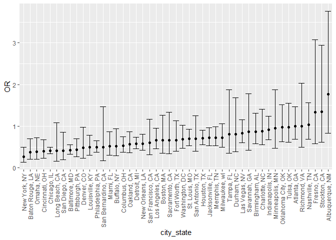
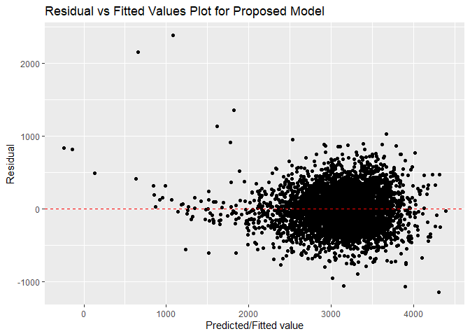
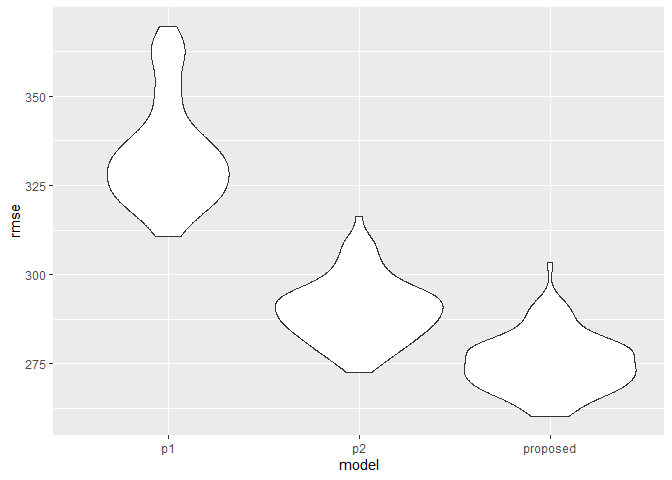
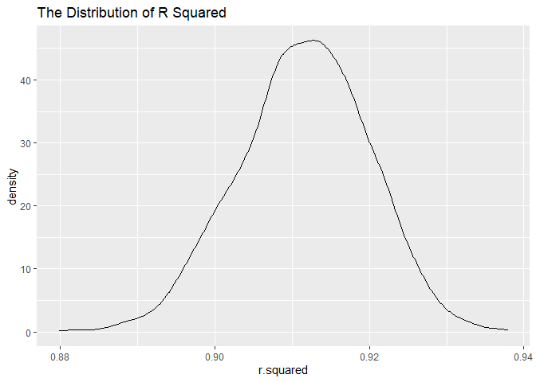
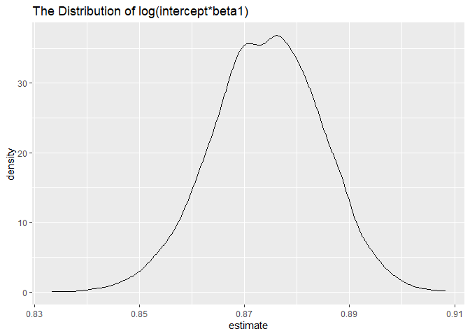

p8105\_hw6\_ps3194
================
Pangsibo Shen
12/5/2020

``` r
library(tidyverse)
library(modelr)
library(p8105.datasets)
library(broom)
```

## Problem 1

``` r
homicide_df = 
  read_csv("data/homicide-data.csv", na = c("", "NA", "Unknown")) %>%
  mutate(
    city_state = str_c(city, state, sep = ", "),
    victim_age = as.numeric(victim_age),
    resolution = case_when(
      disposition == "Closed without arrest" ~ 0,
      disposition == "Open/No arrest"        ~ 0,
      disposition == "Closed by arrest"      ~ 1)
    ) %>% 
  filter(
    victim_race %in% c("White", "Black"),
    city_state != c("Tulsa, AL")
    ) %>%
  select(city_state, resolution, victim_age, victim_race, victim_sex)
```

    ## 
    ## -- Column specification --------------------------------------------------------
    ## cols(
    ##   uid = col_character(),
    ##   reported_date = col_double(),
    ##   victim_last = col_character(),
    ##   victim_first = col_character(),
    ##   victim_race = col_character(),
    ##   victim_age = col_double(),
    ##   victim_sex = col_character(),
    ##   city = col_character(),
    ##   state = col_character(),
    ##   lat = col_double(),
    ##   lon = col_double(),
    ##   disposition = col_character()
    ## )

``` r
homicide_df %>%
  head() %>%
  knitr::kable()
```

| city\_state     | resolution | victim\_age | victim\_race | victim\_sex |
| :-------------- | ---------: | ----------: | :----------- | :---------- |
| Albuquerque, NM |          0 |          15 | White        | Female      |
| Albuquerque, NM |          0 |          72 | White        | Female      |
| Albuquerque, NM |          0 |          91 | White        | Female      |
| Albuquerque, NM |          0 |          56 | White        | Male        |
| Albuquerque, NM |          0 |          NA | White        | Male        |
| Albuquerque, NM |          1 |          43 | White        | Female      |

Start with one city Baltimore.

``` r
baltimore_df =
  homicide_df %>% 
  filter(city_state == "Baltimore, MD")

glm(resolution ~ victim_age + victim_race + victim_sex,
    data = baltimore_df,
    family = binomial()) %>%
  broom::tidy() %>%
  mutate(
    OR = exp(estimate),
    CI_lower = exp(estimate - 1.96 * std.error),
    CI_upper = exp(estimate + 1.96 * std.error)
  ) %>%
  select(term, OR, starts_with("CI")) %>%
  knitr::kable(digits = 3)
```

| term              |    OR | CI\_lower | CI\_upper |
| :---------------- | ----: | --------: | --------: |
| (Intercept)       | 1.363 |     0.975 |     1.907 |
| victim\_age       | 0.993 |     0.987 |     1.000 |
| victim\_raceWhite | 2.320 |     1.648 |     3.268 |
| victim\_sexMale   | 0.426 |     0.325 |     0.558 |

The adjusted odds ratio for solving homicides for white is 2.32 with a
Confidence Interval (1.648, 3.268). In other words, keeping all other
variables fixed, the odds of non-white victim cases been resolved is
2.32 times the odds of white victims cases and we’re 95% confidence that
the true aOR falls within 1.648 and 3.268.

``` r
models_results_df = 
  homicide_df %>%
  nest(data = -city_state) %>%
  mutate(
    models = 
      map(.x = data, ~glm(resolution ~ victim_age + victim_race + victim_sex, data = .x, family = binomial())),
    results = map(models, broom::tidy)
  ) %>%
  select(city_state, results) %>%
  unnest(results) %>%
  mutate(
    OR = exp(estimate),
    CI_lower = exp(estimate - 1.96 * std.error),
    CI_upper = exp(estimate + 1.96 * std.error)
  ) %>%
  select(city_state, term, OR, starts_with("CI"))
```

``` r
models_results_df %>%
  filter(term == "victim_sexMale") %>%
  mutate(city_state = fct_reorder(city_state,OR)) %>%
  ggplot(aes(x = city_state, y = OR)) +
  geom_point() +
  geom_errorbar(aes(ymin = CI_lower, ymax = CI_upper)) +
  theme(axis.text.x = element_text(angle = 90, vjust = 0.5, hjust = 1))
```

<!-- -->
Albuquerque, NM, Stockton, CA and Fresno, CA have the highest aORs for
solving homicides comparing Black victims to white victims among all the
cities. These three cities also have the widest ranges for CIs among all
the cities. New York City has the lowest aORs for solving homicides
comparing Black victims to white victims among all the cities and it’s
CI doesn’t include 1. Hence, we can conclude that in New York City, it
is more likely for a white-victim case to be solved comparing to a
non-white victim case.

-----

## Problem 2

``` r
birthweight_df = 
  read_csv("data/birthweight.csv") %>%
  mutate(
    babysex = as.factor(babysex),
    frace = as.factor(frace),
    malform = as.factor(malform),
    mrace = as.factor(mrace)
  ) %>%
  relocate(bwt, .after = wtgain)
```

    ## 
    ## -- Column specification --------------------------------------------------------
    ## cols(
    ##   .default = col_double()
    ## )
    ## i Use `spec()` for the full column specifications.

``` r
# Fit a regression using all predictors
mult_fit = lm(bwt ~., data = birthweight_df)
summary(mult_fit)
```

    ## 
    ## Call:
    ## lm(formula = bwt ~ ., data = birthweight_df)
    ## 
    ## Residuals:
    ##      Min       1Q   Median       3Q      Max 
    ## -1097.68  -184.86    -3.33   173.09  2344.15 
    ## 
    ## Coefficients: (3 not defined because of singularities)
    ##               Estimate Std. Error t value Pr(>|t|)    
    ## (Intercept) -6265.3914   660.4011  -9.487  < 2e-16 ***
    ## babysex2       28.7073     8.4652   3.391 0.000702 ***
    ## bhead         130.7781     3.4523  37.881  < 2e-16 ***
    ## blength        74.9536     2.0217  37.075  < 2e-16 ***
    ## delwt           4.1007     0.3948  10.386  < 2e-16 ***
    ## fincome         0.2898     0.1795   1.614 0.106551    
    ## frace2         14.3313    46.1501   0.311 0.756168    
    ## frace3         21.2361    69.2960   0.306 0.759273    
    ## frace4        -46.9962    44.6782  -1.052 0.292912    
    ## frace8          4.2969    74.0741   0.058 0.953745    
    ## gaweeks        11.5494     1.4654   7.882 4.06e-15 ***
    ## malform1        9.7650    70.6259   0.138 0.890039    
    ## menarche       -3.5508     2.8951  -1.226 0.220083    
    ## mheight         9.7874    10.3116   0.949 0.342588    
    ## momage          0.7593     1.2221   0.621 0.534418    
    ## mrace2       -151.4354    46.0453  -3.289 0.001014 ** 
    ## mrace3        -91.3866    71.9190  -1.271 0.203908    
    ## mrace4        -56.4787    45.1369  -1.251 0.210901    
    ## parity         95.5411    40.4793   2.360 0.018307 *  
    ## pnumlbw             NA         NA      NA       NA    
    ## pnumsga             NA         NA      NA       NA    
    ## ppbmi           4.3538    14.8913   0.292 0.770017    
    ## ppwt           -3.4716     2.6121  -1.329 0.183913    
    ## smoken         -4.8544     0.5871  -8.269  < 2e-16 ***
    ## wtgain              NA         NA      NA       NA    
    ## ---
    ## Signif. codes:  0 '***' 0.001 '**' 0.01 '*' 0.05 '.' 0.1 ' ' 1
    ## 
    ## Residual standard error: 272.5 on 4320 degrees of freedom
    ## Multiple R-squared:  0.7183, Adjusted R-squared:  0.717 
    ## F-statistic: 524.6 on 21 and 4320 DF,  p-value: < 2.2e-16

In order to propose a regression model for birthweight, I am going to
implement backward elimination which takes out non-significant variables
‘one at a time’ starting with the highest p-value until all
non-significant predictors have been removed.

``` r
# backward elimination
step(mult_fit, direction = 'backward')
```

    ## Start:  AIC=48717.83
    ## bwt ~ babysex + bhead + blength + delwt + fincome + frace + gaweeks + 
    ##     malform + menarche + mheight + momage + mrace + parity + 
    ##     pnumlbw + pnumsga + ppbmi + ppwt + smoken + wtgain
    ## 
    ## 
    ## Step:  AIC=48717.83
    ## bwt ~ babysex + bhead + blength + delwt + fincome + frace + gaweeks + 
    ##     malform + menarche + mheight + momage + mrace + parity + 
    ##     pnumlbw + pnumsga + ppbmi + ppwt + smoken
    ## 
    ## 
    ## Step:  AIC=48717.83
    ## bwt ~ babysex + bhead + blength + delwt + fincome + frace + gaweeks + 
    ##     malform + menarche + mheight + momage + mrace + parity + 
    ##     pnumlbw + ppbmi + ppwt + smoken
    ## 
    ## 
    ## Step:  AIC=48717.83
    ## bwt ~ babysex + bhead + blength + delwt + fincome + frace + gaweeks + 
    ##     malform + menarche + mheight + momage + mrace + parity + 
    ##     ppbmi + ppwt + smoken
    ## 
    ##            Df Sum of Sq       RSS   AIC
    ## - frace     4    124365 320848704 48712
    ## - malform   1      1419 320725757 48716
    ## - ppbmi     1      6346 320730684 48716
    ## - momage    1     28661 320752999 48716
    ## - mheight   1     66886 320791224 48717
    ## - menarche  1    111679 320836018 48717
    ## - ppwt      1    131132 320855470 48718
    ## <none>                  320724338 48718
    ## - fincome   1    193454 320917792 48718
    ## - parity    1    413584 321137922 48721
    ## - mrace     3    868321 321592659 48724
    ## - babysex   1    853796 321578134 48727
    ## - gaweeks   1   4611823 325336161 48778
    ## - smoken    1   5076393 325800732 48784
    ## - delwt     1   8008891 328733230 48823
    ## - blength   1 102050296 422774634 49915
    ## - bhead     1 106535716 427260054 49961
    ## 
    ## Step:  AIC=48711.51
    ## bwt ~ babysex + bhead + blength + delwt + fincome + gaweeks + 
    ##     malform + menarche + mheight + momage + mrace + parity + 
    ##     ppbmi + ppwt + smoken
    ## 
    ##            Df Sum of Sq       RSS   AIC
    ## - malform   1      1447 320850151 48710
    ## - ppbmi     1      6975 320855679 48710
    ## - momage    1     28379 320877083 48710
    ## - mheight   1     69502 320918206 48710
    ## - menarche  1    115708 320964411 48711
    ## - ppwt      1    133961 320982665 48711
    ## <none>                  320848704 48712
    ## - fincome   1    194405 321043108 48712
    ## - parity    1    414687 321263390 48715
    ## - babysex   1    852133 321700837 48721
    ## - gaweeks   1   4625208 325473911 48772
    ## - smoken    1   5036389 325885093 48777
    ## - delwt     1   8013099 328861802 48817
    ## - mrace     3  13540415 334389119 48885
    ## - blength   1 101995688 422844392 49908
    ## - bhead     1 106662962 427511666 49956
    ## 
    ## Step:  AIC=48709.53
    ## bwt ~ babysex + bhead + blength + delwt + fincome + gaweeks + 
    ##     menarche + mheight + momage + mrace + parity + ppbmi + ppwt + 
    ##     smoken
    ## 
    ##            Df Sum of Sq       RSS   AIC
    ## - ppbmi     1      6928 320857079 48708
    ## - momage    1     28660 320878811 48708
    ## - mheight   1     69320 320919470 48708
    ## - menarche  1    116027 320966177 48709
    ## - ppwt      1    133894 320984044 48709
    ## <none>                  320850151 48710
    ## - fincome   1    193784 321043934 48710
    ## - parity    1    414482 321264633 48713
    ## - babysex   1    851279 321701430 48719
    ## - gaweeks   1   4624003 325474154 48770
    ## - smoken    1   5035195 325885346 48775
    ## - delwt     1   8029079 328879230 48815
    ## - mrace     3  13553320 334403471 48883
    ## - blength   1 102009225 422859375 49906
    ## - bhead     1 106675331 427525481 49954
    ## 
    ## Step:  AIC=48707.63
    ## bwt ~ babysex + bhead + blength + delwt + fincome + gaweeks + 
    ##     menarche + mheight + momage + mrace + parity + ppwt + smoken
    ## 
    ##            Df Sum of Sq       RSS   AIC
    ## - momage    1     29211 320886290 48706
    ## - menarche  1    117635 320974714 48707
    ## <none>                  320857079 48708
    ## - fincome   1    195199 321052278 48708
    ## - parity    1    412984 321270064 48711
    ## - babysex   1    850020 321707099 48717
    ## - mheight   1   1078673 321935752 48720
    ## - ppwt      1   2934023 323791103 48745
    ## - gaweeks   1   4621504 325478583 48768
    ## - smoken    1   5039368 325896447 48773
    ## - delwt     1   8024939 328882018 48813
    ## - mrace     3  13551444 334408523 48881
    ## - blength   1 102018559 422875638 49904
    ## - bhead     1 106821342 427678421 49953
    ## 
    ## Step:  AIC=48706.02
    ## bwt ~ babysex + bhead + blength + delwt + fincome + gaweeks + 
    ##     menarche + mheight + mrace + parity + ppwt + smoken
    ## 
    ##            Df Sum of Sq       RSS   AIC
    ## - menarche  1    100121 320986412 48705
    ## <none>                  320886290 48706
    ## - fincome   1    240800 321127090 48707
    ## - parity    1    431433 321317724 48710
    ## - babysex   1    841278 321727568 48715
    ## - mheight   1   1076739 321963029 48719
    ## - ppwt      1   2913653 323799943 48743
    ## - gaweeks   1   4676469 325562760 48767
    ## - smoken    1   5045104 325931394 48772
    ## - delwt     1   8000672 328886962 48811
    ## - mrace     3  14667730 335554021 48894
    ## - blength   1 101990556 422876847 49902
    ## - bhead     1 106864308 427750598 49952
    ## 
    ## Step:  AIC=48705.38
    ## bwt ~ babysex + bhead + blength + delwt + fincome + gaweeks + 
    ##     mheight + mrace + parity + ppwt + smoken
    ## 
    ##           Df Sum of Sq       RSS   AIC
    ## <none>                 320986412 48705
    ## - fincome  1    245637 321232048 48707
    ## - parity   1    422770 321409181 48709
    ## - babysex  1    846134 321832545 48715
    ## - mheight  1   1012240 321998651 48717
    ## - ppwt     1   2907049 323893461 48743
    ## - gaweeks  1   4662501 325648912 48766
    ## - smoken   1   5073849 326060260 48771
    ## - delwt    1   8137459 329123871 48812
    ## - mrace    3  14683609 335670021 48894
    ## - blength  1 102191779 423178191 49903
    ## - bhead    1 106779754 427766166 49950

    ## 
    ## Call:
    ## lm(formula = bwt ~ babysex + bhead + blength + delwt + fincome + 
    ##     gaweeks + mheight + mrace + parity + ppwt + smoken, data = birthweight_df)
    ## 
    ## Coefficients:
    ## (Intercept)     babysex2        bhead      blength        delwt      fincome  
    ##   -6098.822       28.558      130.777       74.947        4.107        0.318  
    ##     gaweeks      mheight       mrace2       mrace3       mrace4       parity  
    ##      11.592        6.594     -138.792      -74.887     -100.678       96.305  
    ##        ppwt       smoken  
    ##      -2.676       -4.843

After the backward elimination, we ended up with a new model below:

\[
bwt = \beta_0+\beta_1babysex+\beta_2bhead+\beta_3blength+\beta_4delwt+\beta_5fincome+\beta_6gaweeks+\beta_7mheight+\beta_8mrace + \beta_9parity + \beta_{10}ppwt+ \beta_{11}smoken
\]

``` r
fit_be = lm(formula = bwt ~ babysex + bhead + blength + delwt + fincome + 
    gaweeks + mheight + mrace + parity + ppwt + smoken, data = birthweight_df)
summary(fit_be)
```

    ## 
    ## Call:
    ## lm(formula = bwt ~ babysex + bhead + blength + delwt + fincome + 
    ##     gaweeks + mheight + mrace + parity + ppwt + smoken, data = birthweight_df)
    ## 
    ## Residuals:
    ##      Min       1Q   Median       3Q      Max 
    ## -1097.18  -185.52    -3.39   174.14  2353.44 
    ## 
    ## Coefficients:
    ##               Estimate Std. Error t value Pr(>|t|)    
    ## (Intercept) -6098.8219   137.5463 -44.340  < 2e-16 ***
    ## babysex2       28.5580     8.4549   3.378 0.000737 ***
    ## bhead         130.7770     3.4466  37.944  < 2e-16 ***
    ## blength        74.9471     2.0190  37.120  < 2e-16 ***
    ## delwt           4.1067     0.3921  10.475  < 2e-16 ***
    ## fincome         0.3180     0.1747   1.820 0.068844 .  
    ## gaweeks        11.5925     1.4621   7.929 2.79e-15 ***
    ## mheight         6.5940     1.7849   3.694 0.000223 ***
    ## mrace2       -138.7925     9.9071 -14.009  < 2e-16 ***
    ## mrace3        -74.8868    42.3146  -1.770 0.076837 .  
    ## mrace4       -100.6781    19.3247  -5.210 1.98e-07 ***
    ## parity         96.3047    40.3362   2.388 0.017004 *  
    ## ppwt           -2.6756     0.4274  -6.261 4.20e-10 ***
    ## smoken         -4.8434     0.5856  -8.271  < 2e-16 ***
    ## ---
    ## Signif. codes:  0 '***' 0.001 '**' 0.01 '*' 0.05 '.' 0.1 ' ' 1
    ## 
    ## Residual standard error: 272.3 on 4328 degrees of freedom
    ## Multiple R-squared:  0.7181, Adjusted R-squared:  0.7173 
    ## F-statistic: 848.1 on 13 and 4328 DF,  p-value: < 2.2e-16

``` r
fit_model =  lm(formula = bwt ~ babysex + bhead  + blength + wtgain + gaweeks + mheight + mrace + parity  + smoken, data = birthweight_df)
summary(fit_model)
```

    ## 
    ## Call:
    ## lm(formula = bwt ~ babysex + bhead + blength + wtgain + gaweeks + 
    ##     mheight + mrace + parity + smoken, data = birthweight_df)
    ## 
    ## Residuals:
    ##      Min       1Q   Median       3Q      Max 
    ## -1136.22  -184.48    -3.76   176.70  2379.79 
    ## 
    ## Coefficients:
    ##               Estimate Std. Error t value Pr(>|t|)    
    ## (Intercept) -6296.4826   134.4912 -46.817  < 2e-16 ***
    ## babysex2       29.0346     8.4921   3.419 0.000634 ***
    ## bhead         132.5955     3.4501  38.432  < 2e-16 ***
    ## blength        75.5344     2.0229  37.340  < 2e-16 ***
    ## wtgain          3.7524     0.3899   9.623  < 2e-16 ***
    ## gaweeks        11.7306     1.4679   7.991 1.70e-15 ***
    ## mheight        11.3305     1.6325   6.940 4.49e-12 ***
    ## mrace2       -140.4014     9.2298 -15.212  < 2e-16 ***
    ## mrace3       -100.0875    42.3207  -2.365 0.018075 *  
    ## mrace4       -104.1201    19.1878  -5.426 6.07e-08 ***
    ## parity         94.5533    40.5114   2.334 0.019642 *  
    ## smoken         -4.7047     0.5874  -8.010 1.46e-15 ***
    ## ---
    ## Signif. codes:  0 '***' 0.001 '**' 0.01 '*' 0.05 '.' 0.1 ' ' 1
    ## 
    ## Residual standard error: 273.6 on 4330 degrees of freedom
    ## Multiple R-squared:  0.7154, Adjusted R-squared:  0.7147 
    ## F-statistic: 989.5 on 11 and 4330 DF,  p-value: < 2.2e-16

After reviewed the summary of the model after backward elimination, we
took additional step to drop the fincome since its p-value is greater
than 0.05. We also removed delwt and ppwt and added wtgain which is
delwt - ppwt. Finally, we got the fit\_model as the proposed model.

\[
bwt = \beta_0+\beta_1babysex+\beta_2bhead+\beta_3blength+\beta_4wtgain+\beta_5gaweeks+\beta_6mheight+\beta_7mrace + \beta_8parity + \beta_9smoken
\]

``` r
# Diagnostics
birthweight_df %>% 
  modelr::add_residuals(fit_model) %>% 
  modelr::add_predictions(fit_model) %>% 
  ggplot(aes(x = pred, y = resid)) + 
  geom_point() +
  xlab("Predicted/Fitted value") +
  ylab("Residual") +
  ggtitle("Residual vs Fitted Values Plot for Proposed Model") +
  geom_hline(yintercept=00, linetype = "dashed", color = "red")
```

<!-- -->

Now let’s construct the other two models provided by the prompt\!

``` r
fit_p1 = lm(formula = bwt ~ blength + gaweeks, data = birthweight_df)
tidy(fit_p1)
```

    ## # A tibble: 3 x 5
    ##   term        estimate std.error statistic  p.value
    ##   <chr>          <dbl>     <dbl>     <dbl>    <dbl>
    ## 1 (Intercept)  -4348.      98.0      -44.4 0.      
    ## 2 blength        129.       1.99      64.6 0.      
    ## 3 gaweeks         27.0      1.72      15.7 2.36e-54

``` r
fit_p2 = lm(formula = bwt ~ babysex*bhead*blength, data = birthweight_df)
tidy(fit_p2)
```

    ## # A tibble: 8 x 5
    ##   term                    estimate std.error statistic      p.value
    ##   <chr>                      <dbl>     <dbl>     <dbl>        <dbl>
    ## 1 (Intercept)            -7177.     1265.       -5.67  0.0000000149
    ## 2 babysex2                6375.     1678.        3.80  0.000147    
    ## 3 bhead                    182.       38.1       4.78  0.00000184  
    ## 4 blength                  102.       26.2       3.90  0.0000992   
    ## 5 babysex2:bhead          -198.       51.1      -3.88  0.000105    
    ## 6 babysex2:blength        -124.       35.1      -3.52  0.000429    
    ## 7 bhead:blength             -0.554     0.780    -0.710 0.478       
    ## 8 babysex2:bhead:blength     3.88      1.06      3.67  0.000245

``` r
cv_df = 
  crossv_mc(birthweight_df, 100) %>%
  mutate(
    train = map(train, as_tibble),
    test = map(test, as_tibble)
  )
```

``` r
cv_df = 
  cv_df %>% 
  mutate(
    fit_model = map(.x = train, ~ lm(formula = bwt ~ babysex + bhead  + blength + wtgain + gaweeks + mheight + mrace + parity  + smoken, data = .x)),
    fit_p1 = map(.x = train, ~ lm(formula = bwt ~ blength + gaweeks, data = .x)),
    fit_p2 = map(.x = train, ~ lm(formula = bwt ~ babysex*bhead*blength, data = .x))
  ) %>% 
  mutate(
    rmse_proposed = map2_dbl(.x = fit_model, .y = test, ~rmse(model = .x, data = .y)),
    rmse_p1 = map2_dbl(.x = fit_p1, .y = test, ~rmse(model = .x, data = .y)),
    rmse_p2 = map2_dbl(.x = fit_p2, .y = test, ~rmse(model = .x, data = .y))
  )
```

``` r
#calculate mean prediction error across three models
cv_df %>% 
  select(starts_with("rmse")) %>% 
  pivot_longer(
    everything(),
    names_to = "model",
    values_to = "rmse",
    names_prefix = "rmse_"
  ) %>% 
  group_by(model) %>% 
  summarize(avg_rmse = mean(rmse))
```

    ## `summarise()` ungrouping output (override with `.groups` argument)

    ## # A tibble: 3 x 2
    ##   model    avg_rmse
    ##   <chr>       <dbl>
    ## 1 p1           334.
    ## 2 p2           290.
    ## 3 proposed     275.

``` r
#plot the mean prediction error density across three models
cv_df %>% 
  select(starts_with("rmse")) %>% 
  pivot_longer(
    everything(),
    names_to = "model",
    values_to = "rmse",
    names_prefix = "rmse_"
  ) %>% 
  ggplot(aes(x = model, y = rmse)) +
  geom_violin()
```

<!-- --> My
proposed model using backward elimination has the smallest average rmse
of 274.9 among three models. Model p1 which is using length at birth and
gestational age as predictors has the largest average rmse of 335.4.

-----

## Porblem 3

``` r
weather_df = 
  rnoaa::meteo_pull_monitors(
    c("USW00094728"),
    var = c("PRCP", "TMIN", "TMAX"), 
    date_min = "2017-01-01",
    date_max = "2017-12-31") %>%
  mutate(
    name = recode(id, USW00094728 = "CentralPark_NY"),
    tmin = tmin / 10,
    tmax = tmax / 10) %>%
  select(name, id, everything())
```

    ## Registered S3 method overwritten by 'hoardr':
    ##   method           from
    ##   print.cache_info httr

    ## using cached file: C:\Users\pangs\AppData\Local\cache/R/noaa_ghcnd/USW00094728.dly

    ## date created (size, mb): 2020-10-05 00:27:05 (7.537)

    ## file min/max dates: 1869-01-01 / 2020-10-31

``` r
set.seed(123)
#create bootstrap object with 5000 estimates
weather_bootstrap = 
  weather_df %>%
  modelr::bootstrap(5000, id = "strap_number") %>%
  mutate(
    models = map(.x = strap, ~lm(tmax ~tmin, data = .x)), 
    results = map(models, broom::tidy),
    glance = map(models, broom::glance)
  ) %>%
  select(strap_number, results, glance)
```

``` r
#Plot the distribution of r squared
weather_bootstrap %>%
  unnest(glance) %>%
  ggplot(aes(r.squared)) +
  geom_density() +
  ggtitle("The Distribution of R Squared")
```

<!-- -->

``` r
r_squared = 
  weather_bootstrap %>%
  unnest(glance) %>%
  select(r.squared) %>%
  unlist()

#construct 95% CI for r squared
r_squared_CI = 
  tibble(
    mean = mean(r_squared),
    ci_lower = quantile(r_squared, 0.025),
    ci_upper = quantile(r_squared, 0.975)
    )

r_squared_CI
```

    ## # A tibble: 1 x 3
    ##    mean ci_lower ci_upper
    ##   <dbl>    <dbl>    <dbl>
    ## 1 0.912    0.895    0.927

The estimate for R square is 0.9116109 with confidence interval lower
bound of 0.8943557 and upper bound 0.9273405.The distribution for R
squared is a little skewed to the left and doesn’t quite follow a normal
distribution. But since we are using bootstrap, we don’t have to worry
about distribution assumption to make inference.

``` r
#Plot the distribution of log(intercept*beta1)
weather_bootstrap %>%
  unnest(results) %>%
  select(strap_number, term, estimate) %>%
  pivot_wider(names_from  = term, values_from = estimate) %>%
  rename(intercept = '(Intercept)') %>%
  mutate(estimate = log10(intercept*tmin)) %>%
  ggplot(aes(estimate)) +
  geom_density() +
  ggtitle("The Distribution of log(intercept*beta1)")
```

<!-- -->

``` r
log_betas = 
  weather_bootstrap %>%
  unnest(results) %>%
  select(strap_number, term, estimate) %>%
  pivot_wider(names_from  = term, values_from = estimate) %>%
  rename(intercept = '(Intercept)') %>%
  mutate(estimate = log10(intercept*tmin)) %>%
  select(estimate) %>%
  unlist()

#construct 95% CI for log(intercept*beta1)
log_betas_CI = 
  tibble(
    mean = mean(log_betas),
    ci_lower = quantile(log_betas, 0.025),
    ci_upper = quantile(log_betas, 0.975)
    )

log_betas_CI
```

    ## # A tibble: 1 x 3
    ##    mean ci_lower ci_upper
    ##   <dbl>    <dbl>    <dbl>
    ## 1 0.874    0.853    0.894

The estimate for \(log(\hat\beta_0*\hat\beta_1)\) is 0.8744846 with
confidence interval lower bound of 0.85364 and upper bound 0.8940337.
distribution for \(log(\hat\beta_0*\hat\beta_1)\) has two peaks in the
middle. But since we are using bootstrap, we don’t have to worry about
distribution assumption to make inference.
